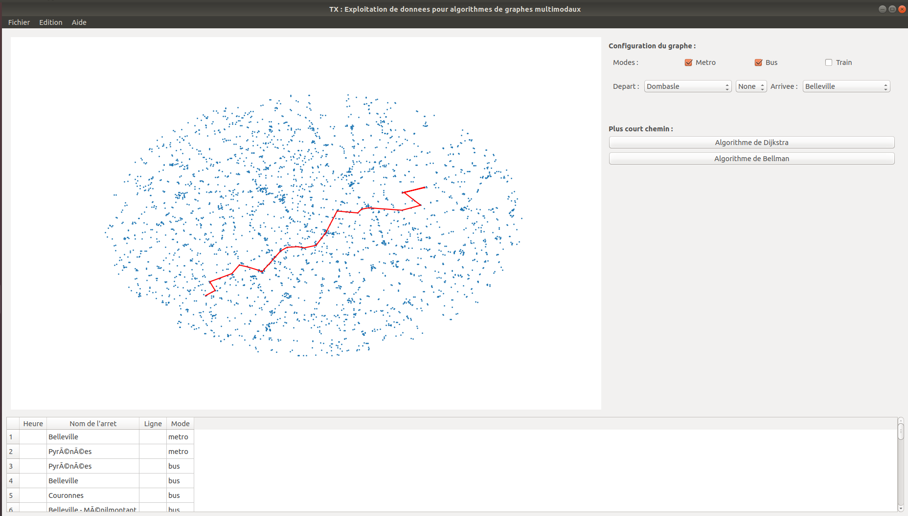

# Graph algorithms applied to GTFS data

Python3 | LMDB | MatplotLib | CSV | GTFS

```
cd app/ && python3 main.py
```

## Screenshot




## Data generation

- Reducing stops with respect to their location (e.g. heart of Paris)
- Building time expanded model of the graph as unordered arcs list
- Building condensed model of the graph (with minimum travel time as arcs' values) as unordered arcs list
- Building successor's list for time expanded model and condensed model (managed with LMDB) : **TODO**

## Algorithms

- Dijkstra's
- Bellman's
- Yen's : **TODO**

## Graph vizualisation

- Drawing graph nodes in GUI and printing optimal paths

## Dependencies

- python3
- csvsort
- matplotlib
- pyqt4

## GTFS data sets

You can download GTFS data sets at [Navitia.io](https://www.navitia.io/datasets). We used and tested with [STIF Transport in Paris and Suburb](https://navitia.opendatasoft.com/explore/dataset/fr-idf/table/?sort=type_file) dataset (default values for stop reduction are specific to this dataset)

Once downloaded, extract the .zip file and select the create folder as workspace within the software execution. 