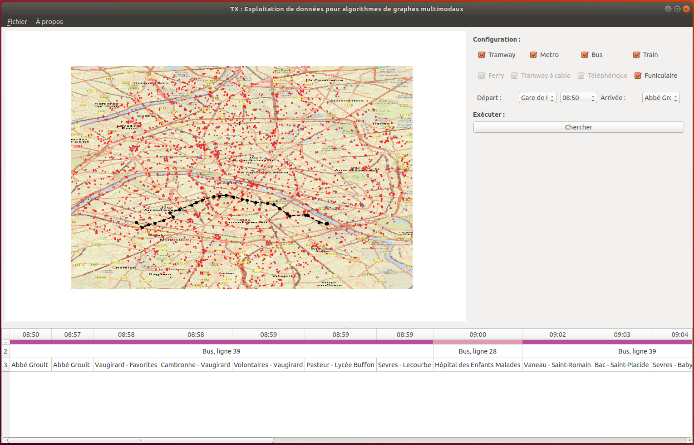

# Multimodal Graphs and Shortest Path problems on real instances (GTFS datasets)

```
cd main/ && python3 main.py
```

## Screenshot



## Data generation

- Import GTFS data in SQLite (optional - recommended - stop reduction)
- Build timetable from GTFS stop_times.txt
- Build successors list with LMDB

## Algorithms

- Dijkstra's algorithm on time dependant model
- Yen's : **TODO**

## Graph vizualisation

- Drawing graph nodes in GUI and printing optimal paths

## Dependencies

This project has been developed with

| Module   | Version  | Description                            |
|:--------:|:--------:|:--------------------------------------:|
| python3  | 3.6.5    |                                        |
| SQLite   | 2.6.0    | SQL file data storage for GTFS queries |
| LMDB     | 0.86     | key-value storage for successor's list | 
|MatPlotLib| 2.1.1    | 2D ploting library                     |
| Qt       | 4.8.7    | GUI module                             |
| PyQt     | 4.12.1   | Qt python adapter                      |

## GTFS data sets

You can download GTFS data sets at [Navitia.io](https://www.navitia.io/datasets). We used and tested with [STIF Transport in Paris and Suburb](https://navitia.opendatasoft.com/explore/dataset/fr-idf/table/?sort=type_file) dataset (default values for stop reduction are specific to this dataset)

Once downloaded, extract the .zip file and select the create folder as workspace within the software execution. 